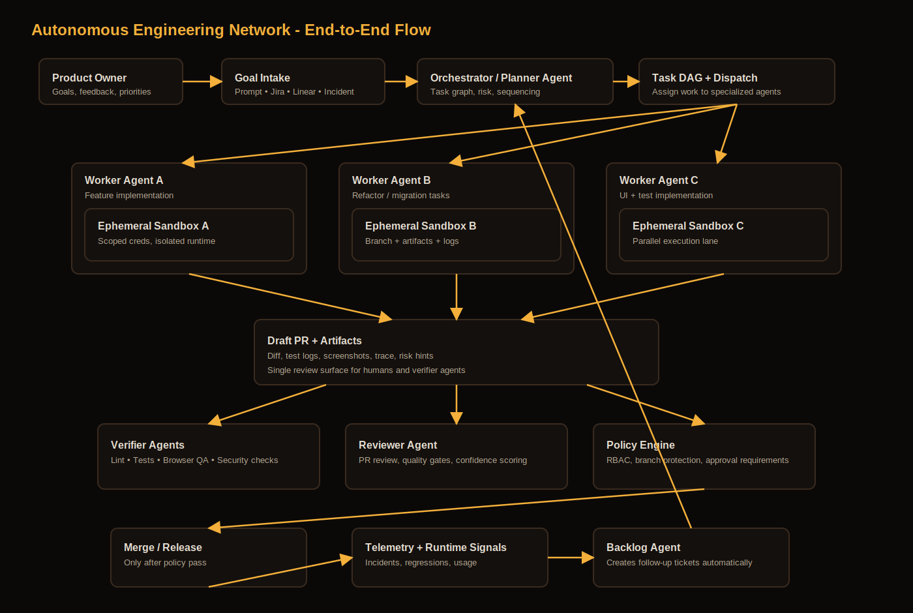

# Autonomous Engineering Network
## Pitch Draft (for founder conversations)

Last updated: February 19, 2026

## 1) The Idea in One Line
Build **trusted autonomous delivery**: not "magic no-human coder," but staged autonomy—draft PR → verified PR → merge with human gate → (optionally) limited full-auto repos. We lead with measurable outcomes: cycle time, regression rate, review load, incident MTTR. The product is an AI engineering network that takes goals (Jira/Linear, prompt, incident), plans and executes via PRs, verifies in a real browser sandbox, and improves the backlog—with human approval at policy gates.

## 2) The Problem
Current AI coding tools are useful but fragmented:
1. One tool plans.
2. Another writes code.
3. Another reviews.
4. Humans still glue everything together across GitHub + Jira/Linear + CI + QA + release.

Result:
1. Context gets lost between steps.
2. Teams waste time orchestrating tools instead of shipping.
3. "Autonomous" claims break down on integration, QA, and governance.

## 3) Product Vision
An "engineering operating system" with:
1. **Planner Agent**: converts goals into scoped implementation plans and task graph.
2. **Worker Agents**: parallel code tasks in isolated sandboxes.
3. **Verifier Agents**: test, lint, static analysis, browser validation, regression checks.
4. **Reviewer Agent**: PR quality pass, risk scoring, release notes, rollback readiness.
5. **Backlog Agent**: continuously opens/refines tickets from failures, logs, and product goals.
6. **Policy Engine**: enforces branch protection, secrets boundaries, compliance checks, human approvals.

## 4) Why This Can Win
Most competitors optimize a single lane (code generation). The wedge is **reliable end-to-end delivery**.

Core differentiation:
1. **Continuous loop** (plan -> implement -> verify -> review -> learn -> next ticket), not one-shot tasking.
2. **Real browser/system validation** before merge, not just unit-test green.
3. **Enterprise-grade governance by default** (sandbox isolation, scoped credentials, approval gates).
4. **Work-management native** (Jira/Linear/GitHub Projects) as first-class control plane.

## 5) How It Works (Reference Architecture)
### Control Plane
1. Ingest goals from prompt, issue, incident, or roadmap item.
2. Build task DAG with dependencies, estimate, risk, and owner-agent.
3. Dispatch tasks to agent pool with concurrency limits.

### Execution Plane
1. Each task runs in ephemeral sandbox with least-privilege credentials.
2. Agents can code, run commands, and open draft PRs.
3. Artifacts (logs, diffs, tests, screenshots, traces) are stored per task.

### Verification Plane
1. CI checks + custom validators.
2. Browser automation for UI and workflow checks.
3. "Definition of done" policy gates before PR state changes.

### Learning Plane
1. Capture failures and postmortems.
2. Generate follow-up tickets automatically.
3. Improve planning templates and routing over time (post-MVP, once the loop is stable).

### Architecture Diagram

## 6) Security and Trust Model
Non-negotiables:
1. Per-task ephemeral environment.
2. Secret broker with short-lived scoped tokens.
3. Repo-level RBAC and allowed-actions policy.
4. Network egress allowlist.
5. Human approval required at merge/deploy thresholds.
6. Full audit trail for every agent action.

## 7) MVP Scope
### First 4–6 weeks: Narrow proof point
Single milestone to validate fast with 3–5 teams:
- **Jira/Linear issue → code PR → browser test evidence → policy scorecard.**
- Track: PR acceptance %, time-to-merge, escaped bugs (and optionally review load).
- If those metrics move, double down on raise/pitch.

### Next 90 days (phased)
**Phase 1 (Weeks 1–3): "Issue to PR with guardrails"**
1. GitHub + Jira/Linear ingest.
2. Planner + single worker.
3. Draft PR + CI + policy summary.

**Phase 2 (Weeks 4–7): "Verification moat"**
1. Add verifier agents.
2. Playwright browser checks.
3. Auto-regression comments on PR.

**Phase 3 (Weeks 8–12): "Continuous backlog loop"**
1. Failure-driven ticket generation.
2. Auto-changelog/release assistant.
3. Prioritization suggestions from repo health metrics.

## 8) How We Measure Success
We lead with metrics that matter to engineering orgs:
- **PR acceptance %** — share of agent PRs accepted (no full revert).
- **Time-to-merge** — cycle time from issue to merged PR.
- **Escaped bugs** — regressions that reach main/production (goal: reduce).
- **Review load** — time humans spend on review vs rubber-stamp (goal: reduce).

These are tracked from day one so we can prove value before scaling pitch and distribution.

## 9) Business Model
1. Usage-based orchestration (compute + verification minutes).
2. Team tier with integrations and policy controls.
3. Enterprise tier: VPC/self-host options, SSO, advanced compliance exports.

## 10) Competitive Landscape (What Exists Today)
### GitHub Copilot Coding Agent
Strengths:
1. Native GitHub workflow and draft PR loop.
2. Agent session visibility and management.

Gap vs our vision:
1. Not a full autonomous multi-agent continuous SDLC loop by default.
2. Limited cross-system orchestration depth.

### Devin (Cognition)
Strengths:
1. Strong autonomous coding narrative.
2. Jira integration and ticket-to-PR workflows.

Gap vs our vision:
1. Less explicit "networked multi-agent control plane" positioning.
2. Enterprise teams still need robust external policy orchestration.

### Factory
Strengths:
1. Broad "agents across SDLC" story.
2. Integrations across tools including Linear/Slack/IDE/web.

Gap vs our vision:
1. Market still early on trustable, deterministic autonomous release loops.
2. Opportunity to lead on governance + verifiability UX.

### OpenHands (open ecosystem)
Strengths:
1. Open platform, cloud and local options.
2. GitHub action and mention-driven automation.

Gap vs our vision:
1. Open ecosystem variance can reduce the enterprise predictability.
2. Requires stronger policy/compliance packaging for risk-sensitive orgs.

### SWE-agent (research/open source)
Strengths:
1. Strong research pedigree and benchmark orientation.
2. Great for experimentation and framework-level innovation.

Gap vs our vision:
1. Not a turnkey enterprise control plane product.
2. Requires significant integration/ops layers for production adoption.

## 11) Why Now
1. Agents are moving from novelty to production workflows.
2. Teams now accept AI-authored PRs, but reliability/governance remains the bottleneck.
3. The winner will be the platform that makes autonomous shipping **auditable, safe, and boringly reliable**.

## 12) Risks (and Mitigations)
1. Hallucinated implementations.
Mitigation: strict verifier gates + typed contracts + sandbox replay.

2. Security concerns.
Mitigation: least privilege, secret vault proxy, immutable audit logs.

3. Tooling fragmentation.
Mitigation: adapter layer for GitHub/Jira/Linear + normalized task model.

4. Slow enterprise trust.
Mitigation: staged autonomy modes:
1. Recommend-only
2. Draft PR only
3. Merge-with-approval
4. Fully automated in bounded repos

## 13) What to Ask Potential Partners/Investors
1. What % of engineering time is lost to coordination vs coding?
2. Where do current AI coding tools break in real production workflows?
3. Which approval/compliance controls are mandatory to allow autonomous merge/deploy?
4. How valuable is a continuous agent backlog manager vs one-off assistant sessions?

## 14) Suggested Positioning Statement
"We are building trusted autonomous delivery: one of the first to combine continuous plan→verify→release with real browser validation and enterprise policy gates. Not just code generation—a full planning-to-release system where the human is the gate, and outcomes (cycle time, regression rate, review load) are measurable."

---

## Appendix: Source Notes (Competitor/Market References)
1. GitHub Copilot coding agent docs (issue -> PR flow): https://docs.github.com/copilot/how-tos/agents/copilot-coding-agent/using-copilot-to-work-on-an-issue
2. GitHub manage agents docs: https://docs.github.com/en/copilot/how-tos/use-copilot-agents/manage-agents
3. GitHub coding agent launch statement: https://github.com/newsroom/press-releases/coding-agent-for-github-copilot
4. Devin Jira integration docs: https://docs.devin.ai/integrations/jira
5. Factory GA announcement: https://factory.ai/news/factory-is-ga
6. Factory product site: https://factory.ai/
7. OpenHands cloud docs: https://docs.openhands.dev/usage/cloud/openhands-cloud
8. OpenHands GitHub integration docs: https://docs.openhands.dev/usage/cloud/github-installation
9. OpenHands GitHub action docs: https://docs.openhands.dev/openhands/usage/how-to/github-action
10. SWE-agent repo: https://github.com/SWE-agent/SWE-agent
11. SWE-agent docs: https://swe-agent.com/0.7/
